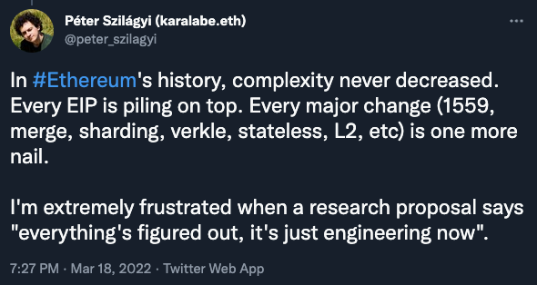
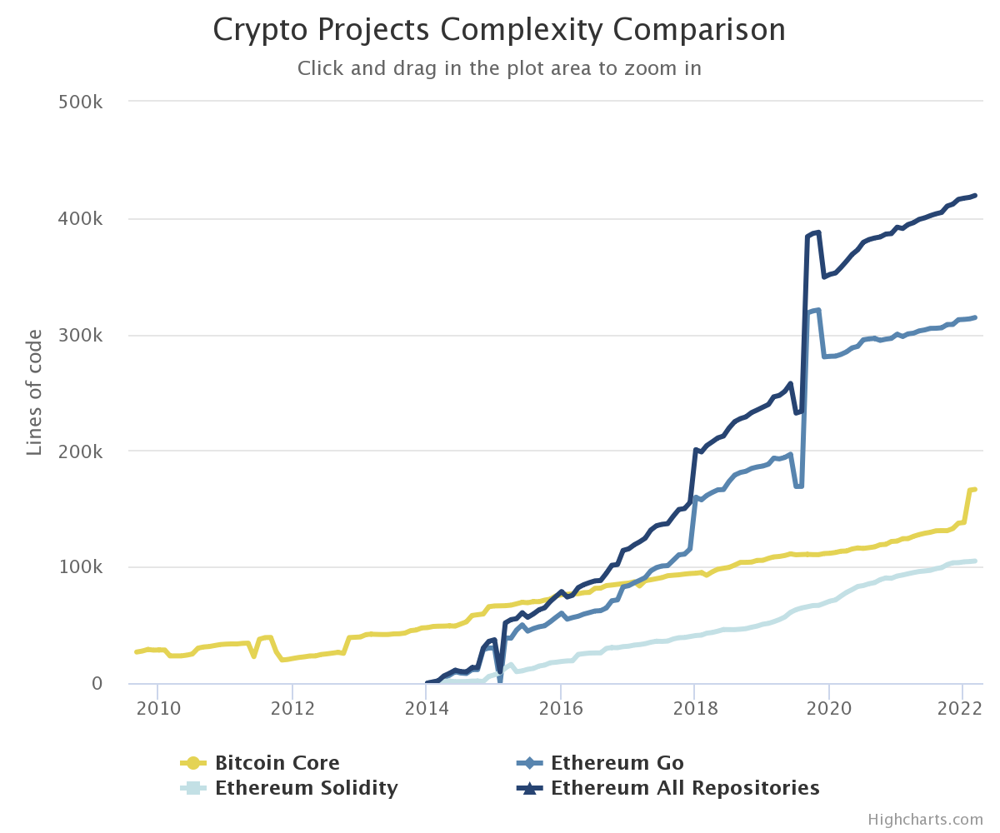

# Crypto projects complexity comparison

This project is a follow-up to this Ethereum development lead tweet

which states that the complexity of Ethereum never decreased and that this might be a worrying trend.

This project tries to:

- Quantify the complexity as lines of code of given project over time
- Compare the biggest crypto projects and see if there are any trends

## Result

- The Bitcoin average code growth per year `17%`
- The Ethereum average code growth per year `46%`

| Year |     BTC |              |     ETH |              |
| ---: | ------: | -----------: | ------: | -----------: |
|      |     LOC | % change y/y |     LOC | % change y/y |
|      |         |              |         |              |
| 2010 |  28,460 |              |         |              |
| 2011 |  33,492 |          18% |         |              |
| 2012 |  21,196 |         -37% |         |              |
| 2013 |  39,631 |          87% |         |              |
| 2014 |  47,685 |          20% |         |              |
| 2015 |  66,327 |          39% |  37,244 |              |
| 2016 |  75,917 |          14% |  78,685 |         111% |
| 2017 |  85,976 |          13% | 115,449 |          47% |
| 2018 |  94,448 |          10% | 200,680 |          74% |
| 2019 | 105,534 |          12% | 237,222 |          18% |
| 2020 | 111,615 |           6% | 237,222 |           0% |
| 2021 | 122,082 |           9% | 391,998 |          65% |
| 2022 | 138,063 |          13% | 417,000 |           6% |
|      |         |              |         |              |
|  AVG |         |          17% |         |          46% |

- Raw data available in [./result/res.json](./result/res.json)
- Or you can generate the `json`, `png` or `csv` yourself by running some of the commands in the [Run docs section](#Run)

## Analysis method

1. Gather repositories of crypto projects (some can have more than one).
2. Find the date of the first and last commit in the given repository.
3. Generate a range of dates with 1-month increments rounded to the start of the month (`2020-01-01`, `2020-02-01`, `2020-03-01`, ..).
   - This Range starts on the first day of the whole month after the first commit and ends on the first day of the month of the last commit (`2010-05-10 — 2020-10-20` -> `2010-06-01 — 2020-10-01`).
4. For each item in this range we find commit at the same date or closest one before the date.
5. For each of these commit we check out the repository and run [cloc](https://www.npmjs.com/package/cloc) binary to determine lines of code in the project at that time.
   - We try to filter:
     - Test code.
     - Benchmark code.
     - Non-core source code files (Markdown, JSON, HTML, translations, ...).
     - Committed external dependencies in the project.

### Notes to certain projects

- Bitcoin
  - Filtered out UI code in `src/qt`.
- Ethereum
  - `go-ethereum` seems to be using 2 submodules and we are not cloning/initializing these nested submodules (we do not do `git submodule --recursive`), so they are not included in the analysis. These submodules seem to only be testing-related, so it is probably correct that they are not included.
  - We include `solidity` in the analysis since it seems to be a core part of the project.
  - Ethereum used to commit external Go vender/dependencies into the project in the `/Godeps` and later in the `/vendor` folders, these are filtered out (with them, the LOC are about 2.5x bigger).

## Run

### Prerequisites

- Node.js and NPM is required

### Install

- Init git submodules `git submodule update --init`
- Install Node dependencies `npm install`

### Start

- Analyze repositories
  - Run `npm run start`
  - Generates `result/res.json`
- Show chart
  - Run `npm run chart`
  - Point your browser to `http://localhost:3000/chart`
    - Click the chart settings button for `csv` or `png` export
